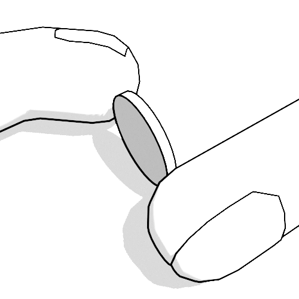

```{r pams,echo=F}
n = 200
ass_link = "https://bart.instructure.com/courses/1314/assignments/21872"
doc_link = "https://chadworley.github.io/a2/u02/project_coin_spin/project_coin_spin.html"
form_link = "https://docs.google.com/forms/d/e/1FAIpQLSdG_HX7rZdUa2xWwHYhvYFyTWdIX1cc96Tn_EvaMCuCqcvLZg/viewform?usp=sf_link"
sheet_link = "https://docs.google.com/spreadsheets/d/1tQe_KXYcLMPUujmhEXb0yZLVSZyaEa_hjwoxx3716cQ/edit?usp=sharing"
```

[`r doc_link`](`r doc_link`)


```{r, echo=F,fig.dim=c(2,2)}
par(mar=c(0,0,0,0),pty="s")
plot(0,0,"n",xlim=c(-1,1),ylim=c(-1,1),ann=F,axes=F)
drawcoin = function(w=0.01,th=0,lincol="black",fillcol="white"){
    thes = seq(0,2*pi,pi/100)
    x1s = cos(thes)
    y1s = sin(thes)
    z1s = rep(-w/2,length(x1s))
    x2s = cos(thes)
    y2s = sin(thes)
    z2s = rep(w/2,length(x2s))
    p1s = matrix(c(x1s,y1s,z1s),3,byrow = T)
    p2s = matrix(c(x2s,y2s,z2s),3,byrow = T)
    R = matrix(c(cos(th),0,sin(th),
                 0,1,0,
                 -sin(th),0,cos(th)),3,byrow=T)
    P = matrix(c(1,0,-0.2,
                 0,1,-0.2),2,byrow=T)
    
    res1 = P %*% R %*% p1s
    res2 = P %*% R %*% p2s
    
    polygon(res1[1,],res1[2,],col=fillcol,border=lincol)
    for(i in 1:(length(res1[1,])-1)){
        polygon(c(res1[1,i],res1[1,i+1],res2[1,i+1],res2[1,i]),
                c(res1[2,i],res1[2,i+1],res2[2,i+1],res2[2,i]),
                col=fillcol,border=lincol
                )
    }
    polygon(res2[1,],res2[2,],col=fillcol,border=lincol)
}

ths = c(pi/6,pi/4,pi/3,5*pi/12,pi/2)

ghostfill = rgb(0.99,0.99,0.99)
ghostline = rgb(0.8,0.8,0.8)
solidfill = rgb(0.5,0.5,0.5)
solidline = rgb(0,0,0)

fills = c(rep(ghostfill,length(ths)-1),solidfill)
lines = c(rep(ghostline,length(ths)-1),solidline)

for(i in 1:length(ths)){
    drawcoin(0.1,ths[i],lines[i],fills[i])
}

```
\

# Overview

A coin flip is equally likely to land heads or tails, so the probability of landing heads is 0.50. However, when a coin is spun on a table (like a top), it can have a different probability of landing heads. The exact probability depends on many factors:

* the coin's relief patterns,
* the coin's material,
* corrosion or gunk,
* the person's spinning style,
* the table surface, and
* probably other things.

Today, we will investigate this in 2 steps:

* Simulate our [null hypothesis](https://en.wikipedia.org/wiki/Null_hypothesis) with 1000 repetitions of `r n` spins assuming $P(\mathrm{heads})=0.5$. In each repetition, find the proportion of heads. Using all the repetitions, get a margin of error for proportion of heads.
* As a class, spin `r n` coins, find the sample proportion. Check if the sample proportion is "within the margin of error".

# Report

* You will organize your work in a [new doc](https://docs.new). You should title it something like "Project Coin Spin". You will write in **full sentences**.
* **Eventually**, your report should have the following sections:
    * Overview
        * Write this summary after you have done everything else, but put it first in your document.
    * Simulation
        * Explain what you are simulating. State specifics:
            * number of repetitions
            * what is simulated in each repetition (and with what code)
            * what statistic is generated each repetition
        * Give a link to your simulation spreadsheet. (And NEVER delete the spreadsheet.)
        * Insert your histogram (as an image) from the simulation. Explain the histogram.
        * Give the margin of error. Explain how you calculated a margin of error. Explain the meaning of the margin of error. 
    * Sample
        * Document the types of coins in the sample. Since there will be many coins, you can give a summary. Give the denomination(s) and range of years. If the reliefs vary, make a note.
        * Explain how the sample was taken. Give details.
        * Give the statistic generated from the sample. (In this case the statistic is the **sample proportion**.)
    * Analysis
        * Determine whether the sample statistic is within the margin of error.
        * Explain what you can conclude.

# Simulation

We want to run 1000 repetitions of flipping `r n` fair coins. We will use a "1" to represent a heads-up result and a "0" to represent a tails-up result. In each repetition, we will calculate the proportion of heads (out of `r n`). From all those proportions, we will find a **margin of error**.

```{r,echo=F}
lets = LETTERS
for(ai in LETTERS){
    for(aj in LETTERS){
        lets = c(lets,paste0(ai,aj,collapse=""))
    }
}
GR = lets[n]
GT = lets[n+2]
```

1. Open a new sheet using [sheets.new](https://sheets.new){target="_blank"}
2. We'll need at least `r n+4` columns. By default we get 26 (A to Z).
    * Highlight all columns.
    * Click `Insert`, `Columns`, and `Insert 26 Columns Right`.
    * Repeat (highlight all and insert columns) until you have at least `r n+4` columns.
3. We can simulate a fair coin with `=IF(RAND()<0.5,1,0)`. Put this formula in A1.
4. Copy the formula into all the cells in range A1:`r GR`1000. You have 1000 repetitions of flipping `r n` fair coins.
5. Freeze your simulation. To do this, select all values (`ctrl+a`), copy (`ctrl+c`), and paste values only (`ctrl+shift+v`).
6. In cell `r GT`1, put a formula to find the proportion of heads in the first row. This could be done in two ways:
    * You can find the total number of heads and divide by the number of flips: ``=SUM(A1:`r GR`1)/COUNT(A1:`r GR`1)``. I guess you know the count is `r n`, so you could write ``=SUM(A1:`r GR`1)/`r n```.
    * Because we are using 0s and 1s, the mean will give the proportion. So, you could use ``=AVERAGE(A1:`r GR`1)``
7. Copy the formula down into all cells in range `r GT`1:`r GT`1000. You now have 1000 proportions. Notice they tend to be near 0.5, but not exactly 0.5.
8. Make a histogram. Adjust the bin size and minimum of the horizontal axis until you have a histogram that nicely suggests a smooth curve (probably bell shaped).
    * Copy the histogram into your report (doc).
9. Find the 2.5th percentile and the 97.5th percentile of the proportions.
10. Find half the difference to get the **margin of error**. Document this in your report. Also, explain what the margin of error is.
11. Also, calculate a margin of error using $2\cdot\frac{\sqrt{0.5\cdot(1-0.5)}}{\sqrt{200}}$. Document this "formula" and its decimal approximation. Compare it to the margin of error from the simulation. 

# Sample

* As a class, we need to spin `r n` coins. Each spin should be on a smooth, hard surface like a table or tiled floor.

{width=30%}

* Press the edge at 2 opposite spots with:
    * Index finger of your left hand
    * Thumb of your right hand
* While holding coin with its bottom edge near the table, press both fingers toward the center with equal but opposite force.
* While maintaining pressure, pull the left-hand index finger toward the left and the right-hand thumb toward the right, causing the coin to snap into a spinning motion.
* The spin will consist of two phases:
    * The coin should spin on a vertical axis. A single point of the coin's edge will maintain contact with the table. This should last at least 5 seconds; otherwise, do not count the spin.
    * The coin will wobble with one face pointing upwards. The contact point will revolve as the coin wobbles. At this stage, the fate is decided, and you can quicken the end by pressing your palm onto the coin.
12. Enter your spins (and coin data) onto our [google form](`r form_link`). You might need to submit multiple forms to help the class get to `r n` spins.
13. Once the class has `r n` spins, you can view [the results](`r sheet_link`).
14. Copy the data (the 0s and 1s) into a new spreadsheet.
    * If you want to shape the data into a single column, you can use the [data wrangler](https://chadworley.github.io/a2/tools/data_wrangler.html). Use `tab` and `newline` as the delimiters. Generate a table with a single column. Copy the table.
15. Calculate the sample proportion.

# Analysis

16. Determine whether the sample proportion is "within the margin of error". Really, check if the absolute difference between 0.5 and the sample proportion is less than the margin of error. Document whether the sample proportion is inside or outside the interval $[0.5-\mathrm{ME},0.5+\mathrm{ME}]$.
17. Document your **conclusion** based on the whether the observation (the sample proportion) is consistent with the model (the simulation).

# Overview

18. Write an overall summary with approximately 4-8 sentences. Put it in the beginning of your report.

# Hand in

19. Export your report document as a pdf. Hand in your pdf [on Canvas](`r ass_link`). 

