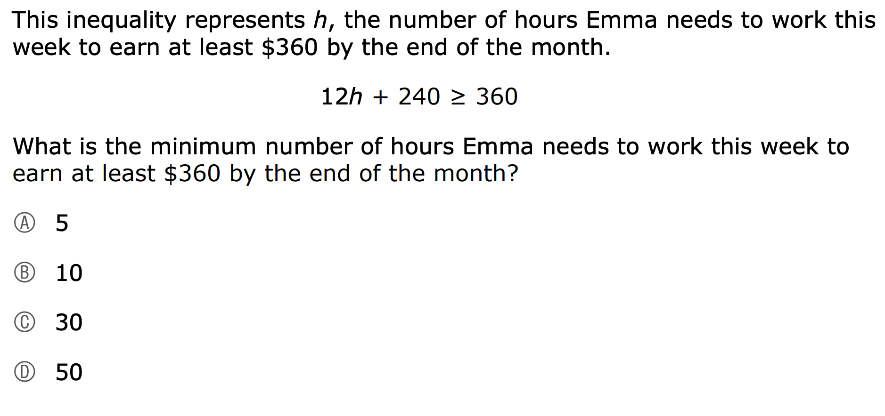

```{r}
include_supplement('007_b.png')
```

Question
========



Answerlist
--------
* a
* b
* c
* d

Solution
========

Meta-information
============
extype: schoice
exsolution: 0100
exname: mcas23_sch_samp
