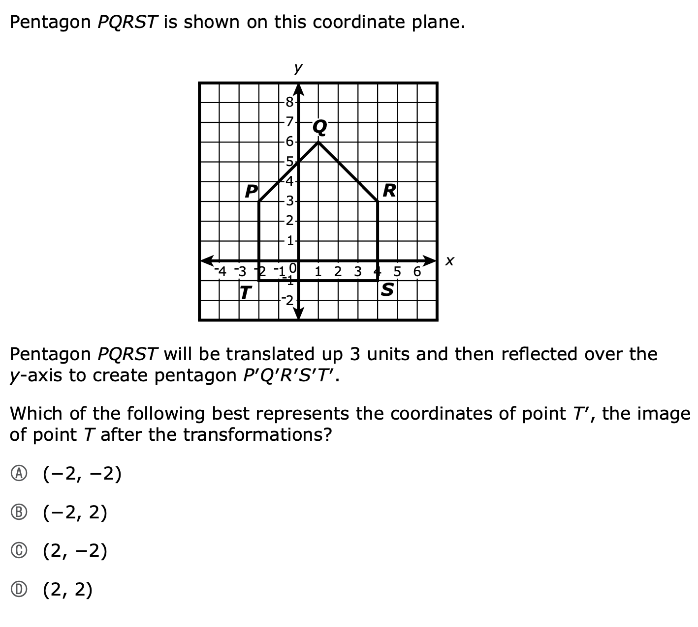

```{r}
include_supplement('038_d.png')
```

Question
========



Answerlist
--------
* a
* b
* c
* d

Solution
========

Meta-information
============
extype: schoice
exsolution: 0001
exname: mcas23_sch_samp
