# Overall Theme

* I explored simple patterns that clearly show the symmetries imposed by the 17 wallpaper groups.
* I wanted a simple shape that has clear asymmetry, so that the symmetries present were clearly imposed by the wallpaper group.
* After some playing, I ended at an eye-patch wearing head. This allows us to check for reflections by seeing the eye patch switch between the head's right and left eyes in the clones.
    
# p1

::: columns
:::: column
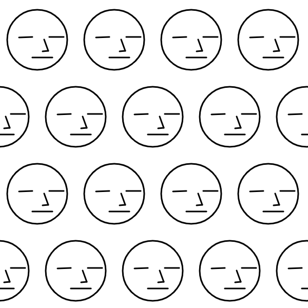{width=100%}
::::
:::: column
* p1 only involves translation. I decided to make it a bit more interesting by having every other row offset, like a brick pattern.
::::
:::

# pg 

::: columns
:::: column
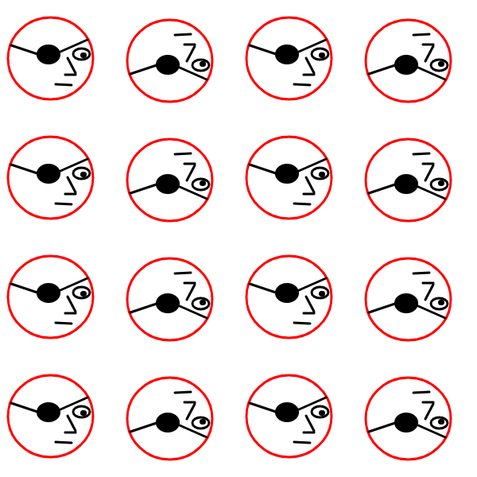{width=100%}
::::
:::: column
* In pg, we use a glide reflection. You can see that the upright head is flipped (reflected) vertically while shifted to the right. I used an eye patch to emphasize that the reflection introduces an evil mirror-world twin (the eye patch moves from human's right eye to left eye with reflection.) 
::::
:::

# pm

::: columns
:::: column
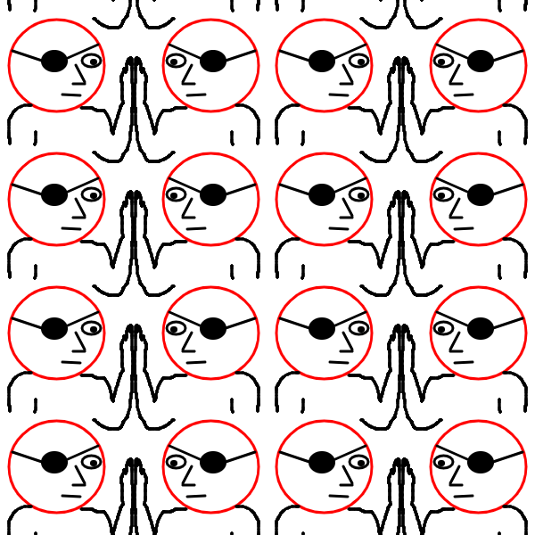{width=100%}
::::
:::: column
* In pm, a simple mirror reflection is used. I imagined our protagonist looking into the mirror, touching the mirror-world evil twin's hand. I drew it badly.
::::
:::

# cm

::: columns
:::: column
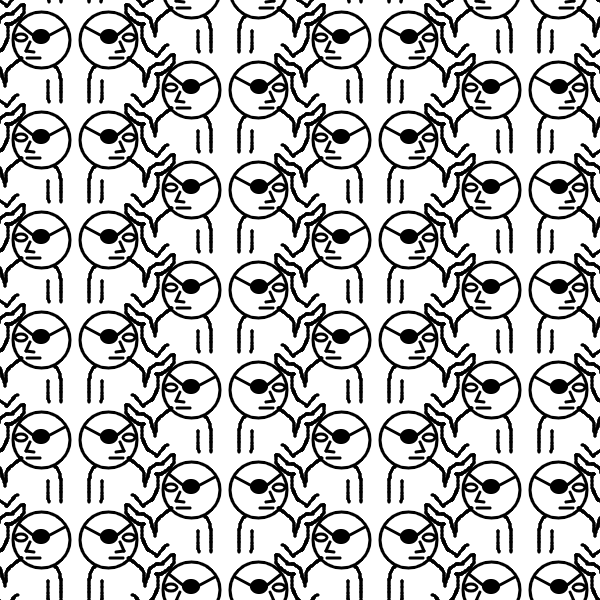{width=100%}
::::
:::: column
* In pm, there seems to be a simple mirror (look at their backs), but then also a glide reflection. While playing, I realized that I could have the protagonist pat the head of a lower glide reflection.
::::
:::

# p2

::: columns
:::: column
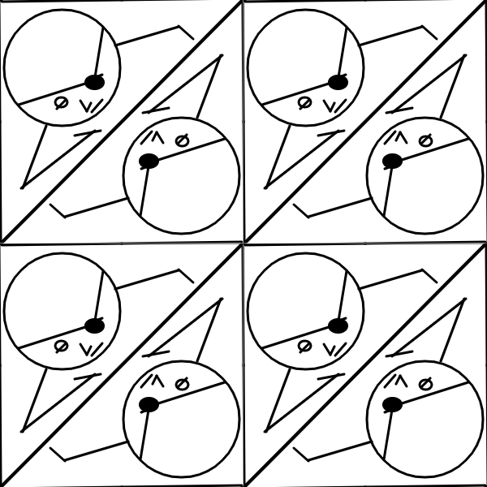{width=100%}
::::
:::: column
* In p2, we only have **rotation**, not reflection. Notice that each eye patch is on the protagonist's left eye.
::::
:::

# pgg

::: columns
:::: column
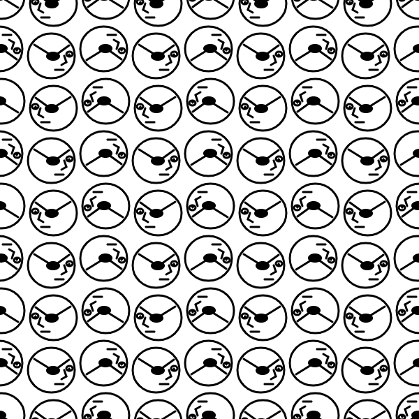{width=100%}
::::
:::: column
* In pgg, we use a glide reflection in both the horizontal or vertical direction. Now there is an evil mirror-world twin on all four sides of each protagonist. 
::::
:::

# pmm

::: columns
:::: column
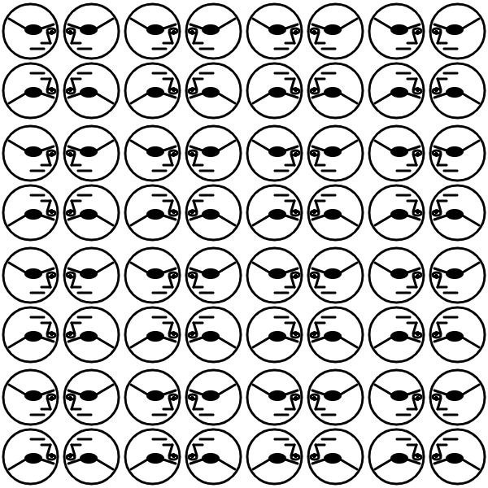{width=100%}
::::
:::: column
* In pmm, a mirror reflection is used both horizontally and vertically. Notice the eye patch is switching. At this point, I've decided to just stick with eye-patch person as long as it seems instructive.
::::
:::

# cmm

::: columns
:::: column
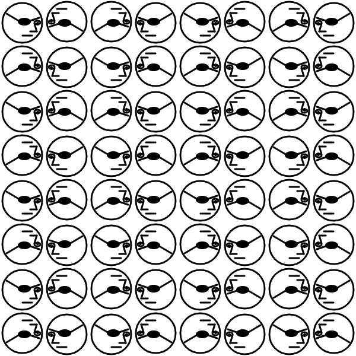{width=100%}
::::
:::: column
* In this cmm, we see that horizontally, we alternate between a rotation and a mirror reflection. Clearly, at this point, we see a lack of additional creativity. I am making these all in very little time.
::::
:::

# pmg

::: columns
:::: column
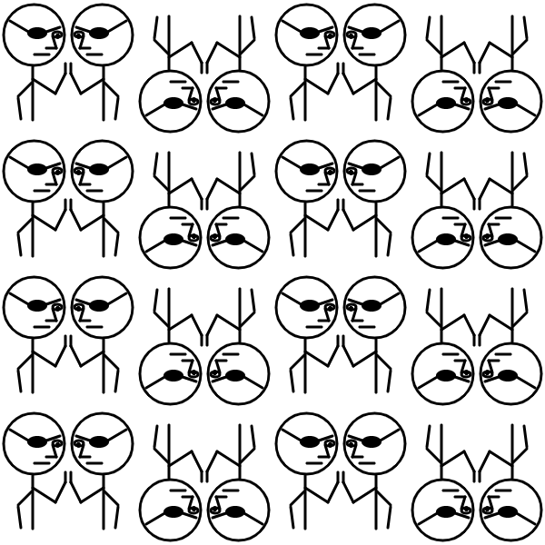{width=100%}
::::
:::: column
* In this pmg, I returned to the idea of reaching out to touch a mirror image's hand. The name "pmg" implies a mirror reflection and a glide reflection. Personally, I see it as each tile having a mirror reflection inside it, and then the whole tile is rotated when translating horizontally.
::::
:::

# p4

::: columns
:::: column
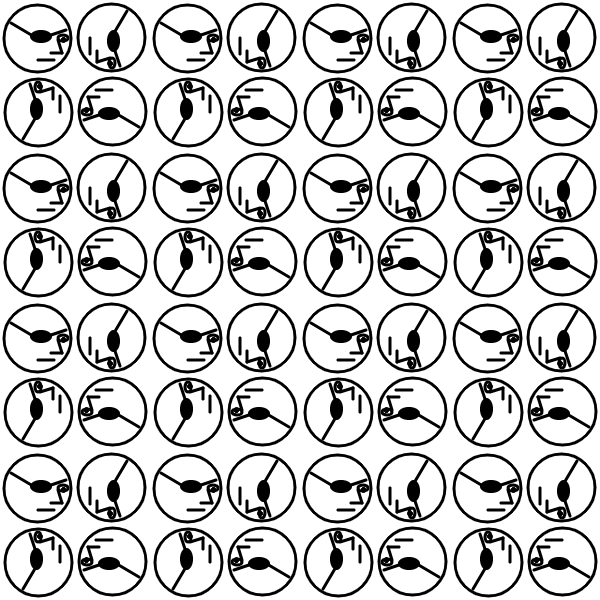{width=100%}
::::
:::: column
* Ah, p4. I feel like there are a lot of possibilities for very cool wallpapers. Notice, all eye patches are on the right eye, so there are no reflections, just rotations.
::::
:::

# p4m

::: columns
:::: column
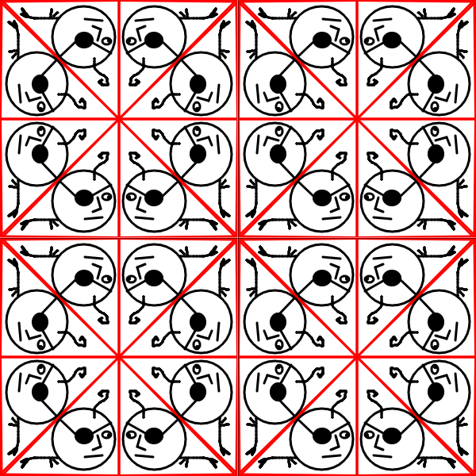{width=100%}
::::
:::: column
* In p4m, I see each square "tile" as made up from 8 wedges that have mirror symmetry with each neighboring wedge. Having this much enforced symmetry will undoubtedly create a lot of beautiful patterns when used with more colors and geometric shapes.
::::
:::

# p4g

::: columns
:::: column
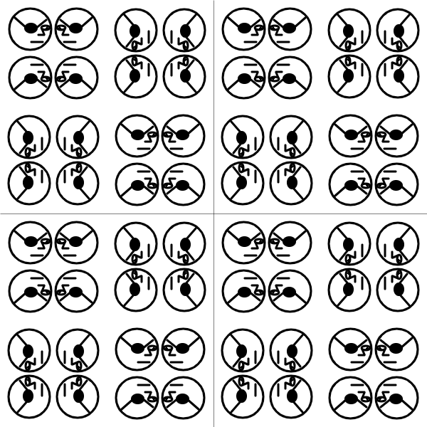{width=100%}
::::
:::: column
* In p4g, we see reflections and rotations. I see it as a pmm to make a 2x2, then with that 2x2, using a p4.
::::
:::

# p3

::: columns
:::: column
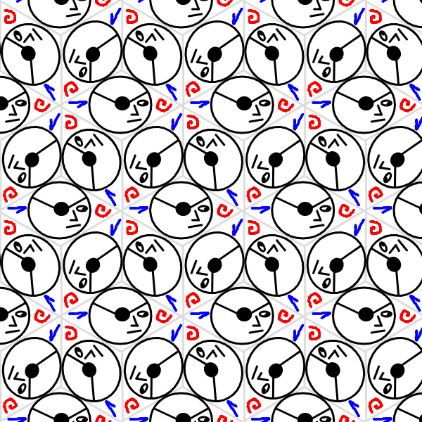{width=100%}
::::
:::: column
* In p3, we get our first example of non-right angles. Here we see rotations of 120 degrees. Notice there are no reflections, just rotations and translations. Other tile shapes are possible, but I think the rhombus outlines are a simple example.
::::
:::

# p3m1

::: columns
:::: column
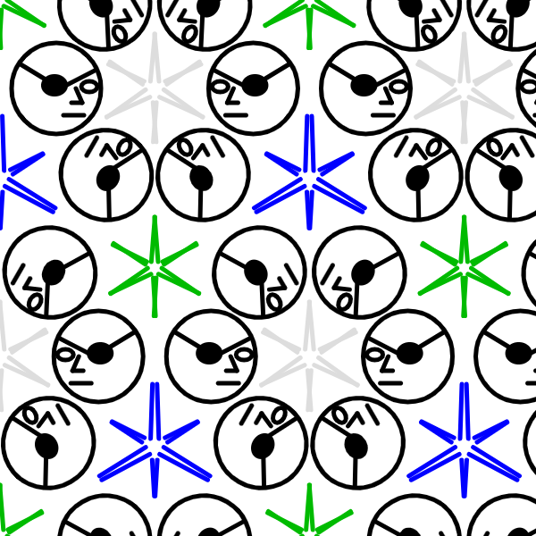{width=100%}
::::
:::: column
* In p3m1, we can see a bunch of equilateral-triangle tiles that are reflected over their edges to make the pattern. I added in the 6-point stars to show the triangular nature of the fundamental element.
::::
:::

# p31m

::: columns
:::: column
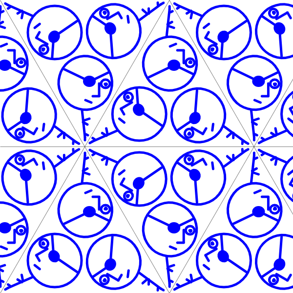{width=100%}
::::
:::: column
* In p31m, it seems like p3 rotations (120 degrees) are used to make one equilaterial-triangle, and then those equilateral triangles are mirrored like p3m1.
::::
:::

# p6

::: columns
:::: column
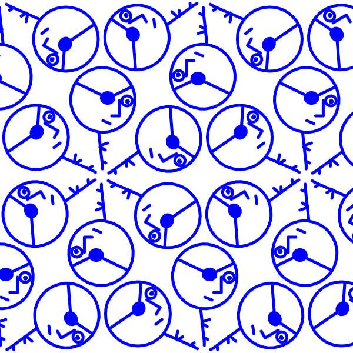{width=100%}
::::
:::: column
* Interesting how similar p6 and p31m are, but p6 is done with only rotations, no reflections.
::::
:::

# p6m

::: columns
:::: column
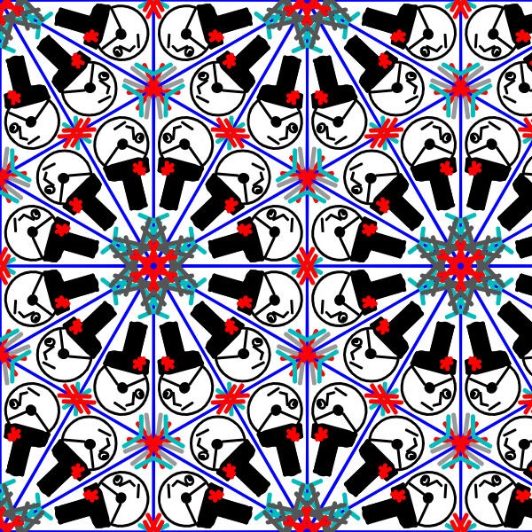{width=100%}
::::
:::: column
* And, finally, p6m. This one has so much going on. I've shown it with a bunch of right triangle tiles, where each right triangle is half of an equilaterial triangle. I also decided to have fun with this one and add some color.
::::
:::

# Conclusion

* I hope my examples helped illuminate the different symmetries imposed by the various symmetry groups.
* I am excited to see other examples that are less attached to the clear depiction of the symmetries. I want designs that radiate and swirl across any possible tile outlines.
* I also want your statements to be looser and more fun.
* By showing only one example of each, I was not able to suggest that the same symmetry groups could have various tile shapes.

