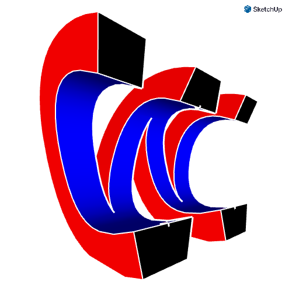
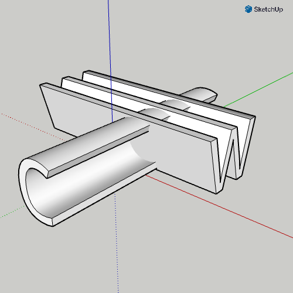

Our goal is to produce a 3D model of the intersection of our first and last initials. For example, my initials are CW, so I ended up with the following object:

```{r, echo=FALSE, out.width="20%", fig.cap="The C and the W intersect to make a cool shape.",fig.align='center'}

```

## Instructions

1. Open [SketchUp](https://app.sketchup.com/app).
2. Start a new project with CENTIMETERS as the unit.
3. Click on the top left `Untitled` to give it a title and save project. I called mine `CW`.
4. Delete the human figure.
5. Click the `Search` (Magnifying glass). Insert `3D text`.
    * In the text box that says "Enter 3D text", write your first initial.
    * Set the Font to `Open Sans`.
    * Set the Height to 5.0 cm.
    * Set the Text Extrusion to 20.0 cm.
    * Click the Okay button.
    * Click on the origin.
6. Zoom into the object.
7. With the Select tool (Space) click once on the 3D text.
8. With the Rotate tool (Q):
    * Hit the Right Arrow key on your keyboard to force rotation around the red axis. The tool should be red.
    * Click on the box's corner at the origin.
    * Click on the corner above (high on the blue axis)
    * Start rotating with the mouse, but type 90. That second corner should now be on the dotted green axis.
9. With the Move tool (M):
    * Click the box's corner at the origin.
    * Start dragging the object along the green axis to bring the object's middle toward the origin.
    * Type `10 cm`.
10. Click the `Search` (Magnifying glass). Insert `3D text`.
    * In the text box that says "Enter 3D text", write your last initial.
    * Set the Font to `Open Sans`.
    * Set the Height to 5.0 cm.
    * Set the Text Extrusion to 20.0 cm.
    * Click the Okay button.
    * Click on the origin.
11. With the Rotate tool (Q):
    * Hit the Down Arrow key on your keyboard to force rotation around the blue axis. The tool should be blue.
    * Click on the box's corner at the origin.
    * Click on the other corner along the green axis.
    * Rotate 90 degrees so that second corner is now at the dotted red axis.
12. With the Rotate tool (Q):
    * Hit the Left Arrow key on your keyboard to force rotation around the green axis. The tool should be green.
    * Click on the box's corner at the origin.
    * Click on the other corner along the blue axis.
    * Rotate 90 degrees so that second corner is now at the solid red axis.
    
```{r, echo=FALSE, out.width="20%", fig.cap="You should have something like this.",fig.align='center'}

```

13. Search for the `Intersect` tool. Click on your first initial and then your second initial.
14. Play with settings to get a cool picture.
    * Styles
    * Remove axes
    * Colors
    * Scenes - FOV
15. Download a PNG. Submit the PNG on Canvas.