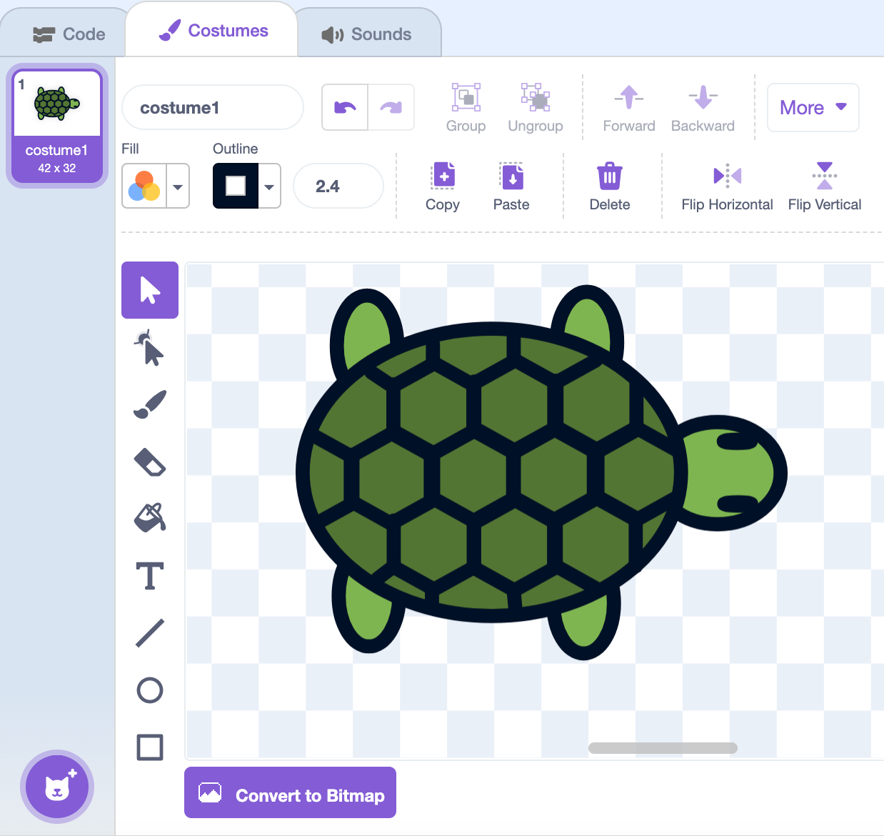
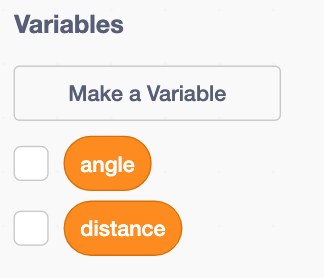
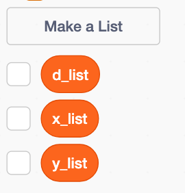
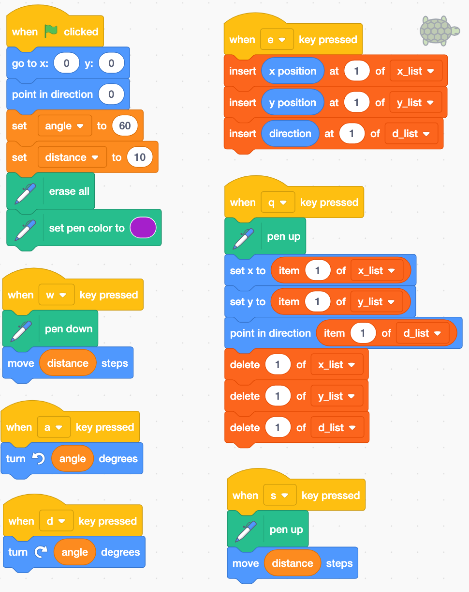

Name: \hspace{4in} Date: \hrule

### L-system Turtle Graphics (part 1)

* In Scratch, we wish to create the following:
    1. A turtle sprite (from bird's-eye view)
    2. Use keyboard buttons to control the turtle using the following moves:
        * W = Move forward
        * D = Turn right
        * A = Turn left
        * S = Hop forward (and do not draw)
        * E = Save position at top of list
        * Q = Return to top-of-list position and delete position from list

## Start a new project

1. Go to [https://scratch.mit.edu](https://scratch.mit.edu)
    * Login to save your work.
    * `Create` a new project. 
2. Click on `Costumes` to edit the cat.
    * Delete the 2nd costume.
    * Change the 1st costume to look like the following turtle:
    
{width=35%}

3. Make the following variables and lists:

 

4. Add the Pen extension! (Purple button in bottom right).

\newpage

5. Write the code:



6. Make the turtle sized small (just big enough to see it is a turtle in fullscreen mode).

\newpage

7. Make a drawing!
    * Go to fullscreen mode.
    * Click the green flag to `Go`.
    * Type the following keys on your keyboard:
    
```{r,echo=F}
s = "[A[-ASA][+ASA]A[-A[-ASA][+ASA]ASSA[-ASA][+ASA]A][+A[-ASA][+ASA]ASSA[-ASA][+ASA]A]A[-ASA][+ASA]A][++A[-ASA][+ASA]A[-A[-ASA][+ASA]ASSA[-ASA][+ASA]A][+A[-ASA][+ASA]ASSA[-ASA][+ASA]A]A[-ASA][+ASA]A][--A[-ASA][+ASA]A[-A[-ASA][+ASA]ASSA[-ASA][+ASA]A][+A[-ASA][+ASA]ASSA[-ASA][+ASA]A]A[-ASA][+ASA]A]SSSSSSSSSSSS"
s = gsub("A","W",s,fixed=T)
s = gsub("B","W",s,fixed=T)
s = gsub("C","W",s,fixed=T)
s = gsub("+","D",s,fixed=T)
s = gsub("-","A",s,fixed=T)
s = gsub("[","E",s,fixed=T)
s = gsub("]","Q",s,fixed=T)

s2 = ""
for(i in 1:(nchar(s)/4)){
    s2 = paste0(s2,substr(s,(i*4-3),(i*4))," ")
    if(i%%10==0){
        s2 = paste0(s2,"\n\n",collapse="")
    }
}

```

\LARGE
```
`r s2`
```
\normalsize

\vfill

8. **Submit** a screenshot of the drawing **on Canvas** under assignment `Scratch: L-sys Turtle pic 1`.

\vfill

\newpage

9. Make your own drawing!
    * Return to the code. Edit the distance, angle, and initial position.
    * Adjust the keys to whatever you want.
    * Add a key that changes the color.
    * Return to fullscreen.
    * Restart by hitting the green flag. (`Go.`)
    * Control the turtle to make a drawing.
10. **Submit** a screenshot of your drawing **on Canvas** under assignment `Scratch: L-sys Turtle pic 2`.
    
    