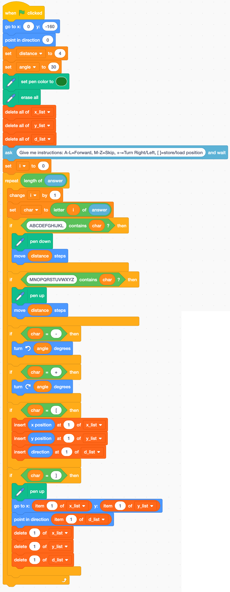

# Scratch: Turtle Command Strings

Wouldn't it be great if we didn't have to type the turtle commands one keystroke at a time? Well, I've got some great news; today we will update our Scratch code so we can simply paste a long string of commands into an `ask/answer` text box.

1. **Save your turtle project AS A COPY**. You could name the copy "Turbo Turtle".
2. Make variables.\

3. Make lists. You probably already have these lists.\

4. Alter your code. You'll notice that a lot of the code from your last project is repeated here. It'll be faster to rearrange your old code than rewrite the whole thing.\

5. Go to this L-system string generator: [https://chadworley.github.io/Lsys_string_gen.html](https://chadworley.github.io/Lsys_string_gen.html)
6. Use the following settings:\

7. Click `Generate Strings`.
8. Click `Copy Last String`.
9. Edit the Scratch parameters. We want to start at $(0,-160)$ heading up, have the distance of each step be $4$, and the turn angle is 30°. I also think the drawing will look good in green, but you can use any color.\

10. In Scratch, click the green flag. Paste the string into the popup. Hit ENTER or RETURN (or click the checkmark). You might find Turbo mode helpful.
11. Take a screenshot of the resulting image (including your turtle). Submit your image on Canvas under assignment `Scratch: L-sys Turtle (pic 3)`.

