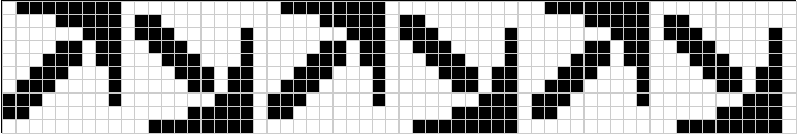
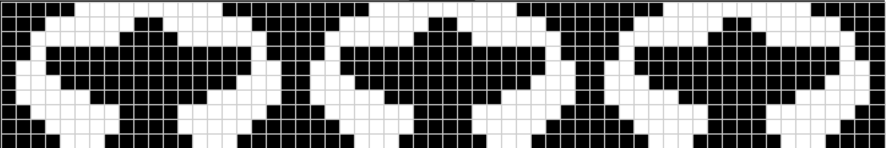
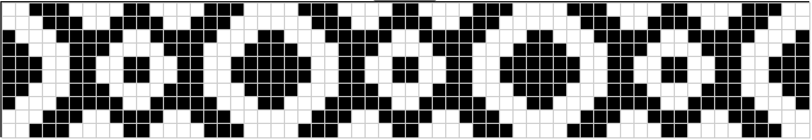

# Group: p1 (hop)

A flock of flamingos standing in a line.

{width=75%}

# Group: p11g (step)

These arrows point up-right and down-right. This pattern clearly shows the glide reflections used in the p11g group.

{width=75%}

# Group: p1m1 (sidle)

These sort of look like airplanes all flying in the same direction. Each airplane is circled. Notice the mirror reflections.

{width=75%}

# Group: p2 (spinning hop)

These spirals show off the rotational symmetries imposed by the p2 Frieze group.

{width=75%}

# Group: p2mg (spinning sidle)

These double-headed arrows snake around but are always facing each other, high or low.

{width=75%}

# Group: p11m (jump)

I made a bunch of coins with the letter C on them. I wanted to make sure to not have mirror symmetry over vertical lines, only over the horizontal midline. 

{width=75%}

# Group: p2mm (spinning jump)

This is a simple pattern that reminds me of a simple decorative strap. Notice that there are both horizontal and vertical lines of mirror symmetry.

{width=75%}

