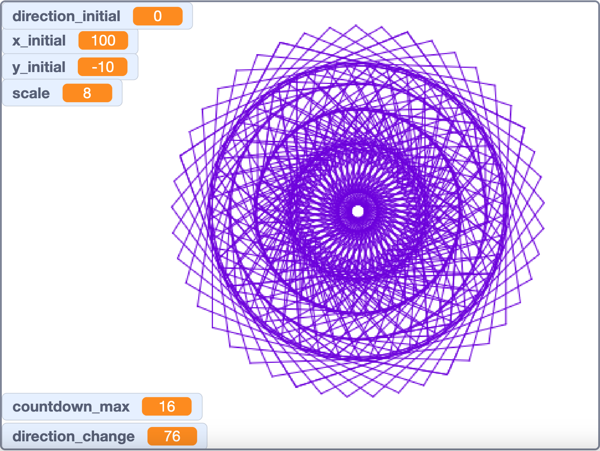
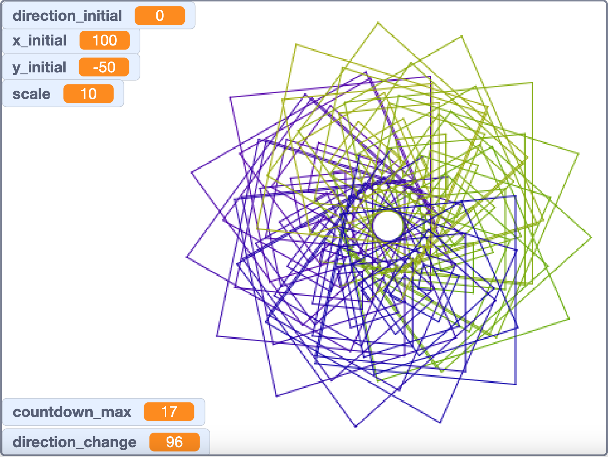
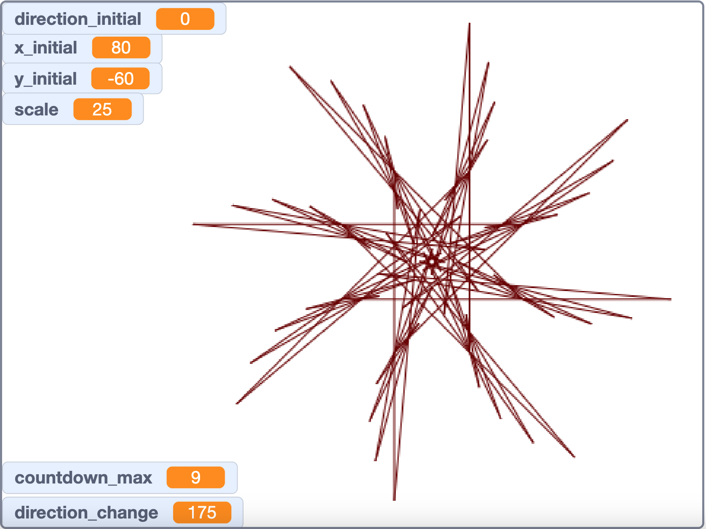
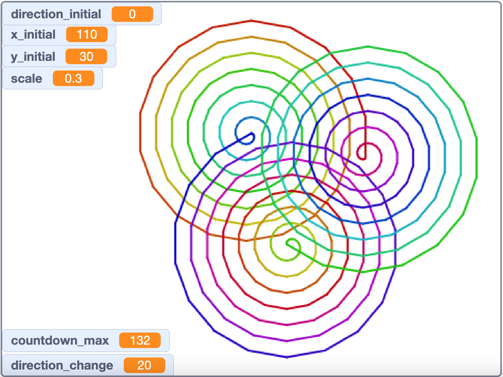
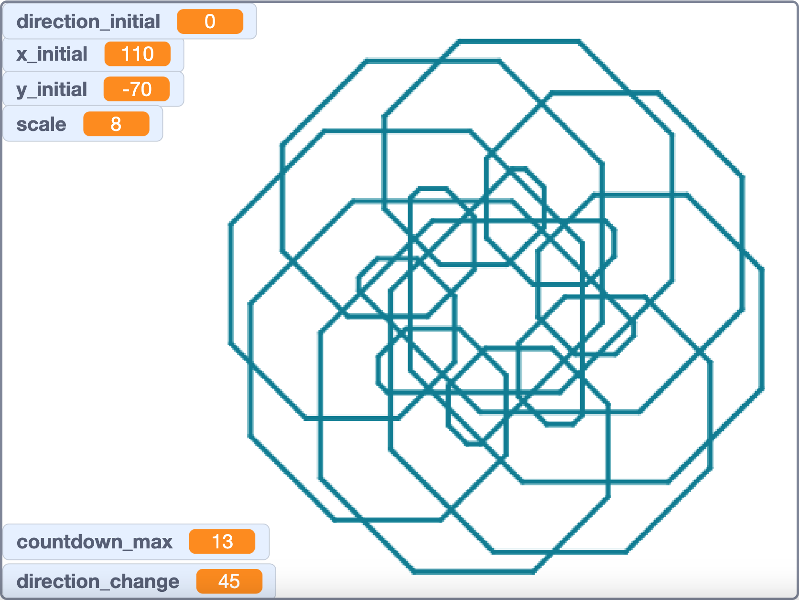
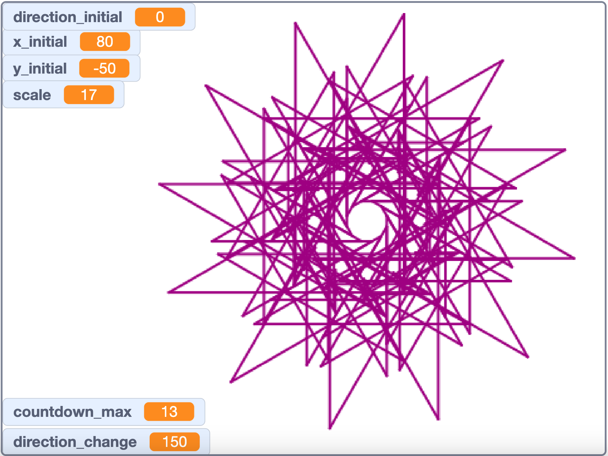

# What you'll do

* Change the color for each pattern.
* Pick new numbers for `countdown_max` and `direction_change`.
* Change `scale`, `x_initial`, and `y_initial` to get a large, centered pattern that does not hit edges or go behind the readouts.
* Use **turbo mode** (under the Edit menu) to draw faster.
* If you like the pattern, screenshot it (including parameters) and paste into slideshow.
* Your slides
    * First slide: a title, your name, and the date
    * next 6 slides: each slide has an image of an interesting spiral pattern
    * Each pattern must have different countdown_max and direction_change!
    * Do not take the screenshot before the drawing is finished.

# What if I'm "done"

* Make better patterns.
* Make more patterns.
* Figure out cool ways to change the color during the drawing.

# Exemplar

* Countdown Spirals
* Chad Worley

# Example 1

# Example 2

# Example 3

# Example 4

# Example 5

# Example 6

