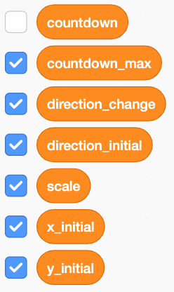
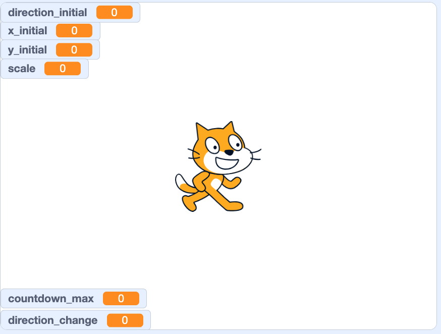
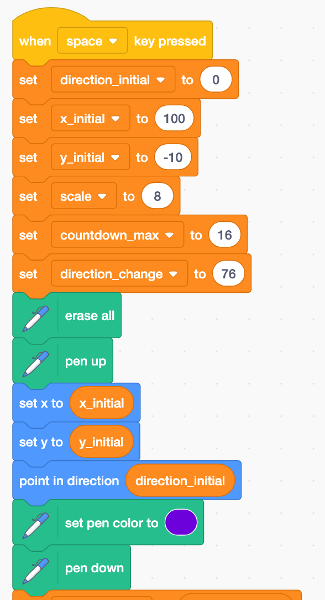
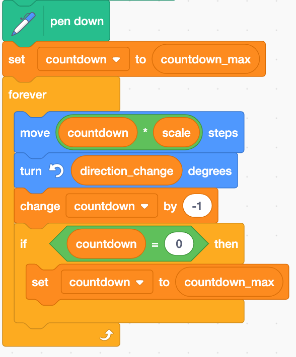
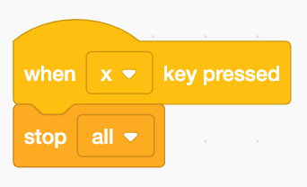
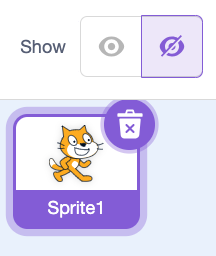
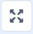

# Scratch: Countdown Spirals

```{r,echo=F,fig.dim=c(7,0.5)}
drawit = function(L=16,dD=-pi/2,D=-pi/2,n=1000){
    x = c(0)
    y = c(0)
    l = L
    for(i in 1:n){
        x0 = x[i]
        y0 = y[i]
        x2 = x[i]+l*cos(D)
        y2 = y[i]+l*sin(D)
        l = (l-2)%%L+1
        D = D+dD
        x = c(x,x2)
        y = c(y,y2)
    }
    xmin = min(x)
    xmax = max(x)
    xmid = mean(c(xmin,xmax))
    ymin = min(y)
    ymax = max(y)
    ymid = mean(c(ymin,ymax))
    r = max(c(xmax-xmid,ymax-ymid))
    xlo = xmid-r
    xhi = xmid+r
    ylo = ymid-r
    yhi = ymid+r
    plot(0,0,"n",axes=F,ann=F,xlim=c(xlo,xhi),ylim=c(ylo,yhi))
    lines(x,y,lwd=0.4)
}

set.seed(123)

par(mfrow=c(1,14),mar=c(0,0,0,0),pty="s",oma=c(0,0,0,0))
Ls = sample(6:30,14,T)
denoms = sample(3:19,14,T)
nums = numeric()
for(i in 1:length(denoms)){
    nums = c(nums,sample(1:(denoms[i]-1),1))
}
dDs = pi*nums/denoms

Ls[12] = 9
dDs[12] = -pi/2

Ls[10] = 19
dDs[10] = -pi/3

Ls[6] = 9
dDs[6] = 175/180*pi

for(i in 1:length(denoms)){
    drawit(L=Ls[i],dD=dDs[i])
}


```

Remember the countdown spirals? In the example below, the pen moves 16 units, then 15 units, then 14 units, and the segments get smaller and smaller down to 1 unit, after which the next segment is 16 units, then 15 units, etc... and after each segment the direction is changed by 72°.

```{r,echo=F,fig.dim=c(0.5,0.5)}
x = c(0)
y = c(0)
n = 1000
L = 16
l = L
D = -pi/2
dD = 2*pi/5
for(i in 1:n){
    x0 = x[i]
    y0 = y[i]
    x2 = x[i]+l*cos(D)
    y2 = y[i]+l*sin(D)
    l = (l-2)%%L+1
    D = D+dD
    x = c(x,x2)
    y = c(y,y2)
}
xmin = min(x)
xmax = max(x)
xmid = mean(c(xmin,xmax))
ymin = min(y)
ymax = max(y)
ymid = mean(c(ymin,ymax))
r = max(c(xmax-xmid,ymax-ymid))
xlo = xmid-r
xhi = xmid+r
ylo = ymid-r
yhi = ymid+r
par(mar=c(0,0,0,0),pty="s")
plot(0,0,"n",axes=F,ann=F,xlim=c(xlo,xhi),ylim=c(ylo,yhi))
lines(x,y)
```


Our goal is to produce these patterns in Scratch. You will **submit a slideshow** with a variety of your best results. You need to have at least 6 high-quality images of distinct spiral patterns for full credit. Each image should also show the parameter settings used to generate the image.

1. Go to [scratch.mit.edu](https://scratch.mit.edu)
    * Login (to save your work)
    * **Create a new project** (click "Create" near top of page.)
2. Click "Add Extension" button (bottom left of screen).
    {width=5%}
    * Choose the **Pen extension**.
3. Make some variables.
    * On left side, click the "Variables" section of code. (The orange dot.)
    * For each variable we need, click "Make a Variable", and then type the variable name.
    * **Make 7 variables**:
        * \color{red}`x_initial`\color{black}: the $x$ coordinate to start the drawing.
        * \color{red}`y_initial`\color{black}: the $y$ coordinate to start the drawing.
        * \color{red}`direction_initial`\color{black}: the direction to move at start of drawing.
        * \color{red}`scale`\color{black}: a multiplier to make drawing bigger or smaller.
        * \color{red}`direction_change`\color{black}: angle turned after each segment (72 in the example above)
        * \color{red}`countdown_max`\color{black}: the highest number when counting down (16 in the example above)
        * \color{red}`countdown`\color{black}: the current countdown number. It starts at `countdown_max`, decreases by 1 after each segment is drawn, and returns to `countdown_max` after reaching 1. This `countdown` variable will change frequently during the course of producing the pattern. Each segment's length is the product of `countdown` times `scale`. The other variables are the "parameters": they will be set before the drawing begins, and not change during the drawing. This one (`countdown`) will be changed over and over by the code. The other variables acting this way are already defined by Scratch: `x position`, `y position`, and `direction`.
    * We want all the parameters to show on the screen, so keep them checked. Uncheck `countdown`.\
    {width=20%}
    
\newpage

4. In the right-most frame, rearrange the parameter readouts by clicking and dragging.
    * The drawings will be mostly circular-ish, so make room for a large circle.\
    {width=50%}
5. Start the code. In the left-most frame, find the correct elements, and drag them into place.
    * After "Space" is hit: set the parameters, clear the previous drawings, lift the pen, move the pen to the initial position and direction, and put the pen back down.
    * You will **set the paramters here** for each drawing.\
{height=60%}
\newpage

6. Code the drawing loop. (All the code from steps 5 and 6 is together in one chunk.) \
{height=40%}
7. Code a new chunk to interrupt the drawing by pressing "x".\
{width=30%}
8. Hide the sprite. (Hide the cat.)
    * Near the bottom-right frame, click the show/hide sprite toggle.\
    {width=20%}
9. If your code gets busted, you can use mine: [https://scratch.mit.edu/projects/1214544750](https://scratch.mit.edu/projects/1214544750)
  


\newpage

10. **DOCUMENT** your own patterns in a slideshow!
    * Adjust the parameters in the top of the code, press space bar to run the code.
        * The main parameters are `countdown_max` and `direction_change`. These fundamentally alter the pattern drawn.
        * The other parameters allow you to scale and move the drawing.
    * **DO NOT** let drawing hit edge of screen. Use a smaller `scale` value if this happens.
    * Try to make the drawing as large as possible without hitting the edge of the window or going behind the readouts.
    * Try to center the image vertically by adjusting the `y_inital` value.
    * **Document your best patterns**. 
        * Start a new slideshow. Use [slides.new](https://slides.new) for google slides.
        * For a title page, include your name, date, and a title... something like "Countdown Spirals"
        * When you have a high-quality spiral, take a screenshot including the readouts. Paste the screenshot into the slideshow as its own slide.
        * Before taking a screenshot, go to full-screen mode. {width=5%} (Button near top-right.)
        
11. You can see an exemplar here:
    * [https://chadworley.github.io/pbl/scratch/exemplar.html](https://chadworley.github.io/pbl/scratch/exemplar.html)

  
    
    
    
    
    
