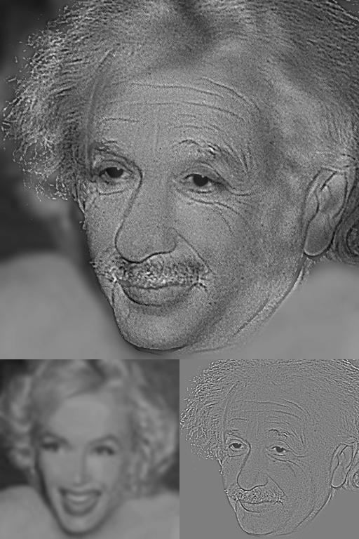

# Hello 

* Chad Worley
* chad.worley@bartcharter.org

# Units

* Statistics
* Functions
* Exponential and Logarithmic Functions
* Trigonometric Functions
* Polar functions, vectors, and complex numbers
* Conic sections

# Statistics

```{r,echo=FALSE,cache=TRUE,fig.width=5,fig.height=4,out.width="80%",fig.align='center'}
x = matrix(sample(1:6,100000,T),ncol=100)
x = apply(x,1,sum)
hist(x = x,breaks=10,main="1000 repetitions of 100d6",xlab="sum of 100 6-sided dice")
```

# Functions

{width=40%}

https://www.desmos.com/calculator/oiv0kjzsik

# Exponential and Logarithmic Functions


```{r,fig.width=5,fig.height=5,echo=F,out.width="50%"}
x = seq(-10,10,0.1)
y = 1.4^x
plot(x,y,xlim=c(-10,10),ylim=c(-10,10),type="l",col="red",axes=T,lwd=2)
lines(y,x,col="blue",lwd=2)
abline(h=0)
abline(v=0)
```
{width=45%}

https://bit.ly/3qxfPop

# Trigonometric Functions


https://www.desmos.com/calculator/fhwymhwulu

{width=30%}
{width=10%}
{width=20%}

https://auditoryneuroscience.com/acoustics/spectrogram

# Vectors, Complex Numbers, Polar Functions, and Parametric Functions

https://www.desmos.com/calculator/ekuv2dg7uv

$$(a_1+ib_1)\cdot(a_2+ib_2) = (r_1 r_2)(\cos(\theta_1+\theta_2)+i\sin(\theta_1+\theta_2))$$

.png){height=60%}


# Conic Sections


https://commons.wikimedia.org/wiki/File:Solar-Cooker-2050-Paris.jpg

{height=70%}


